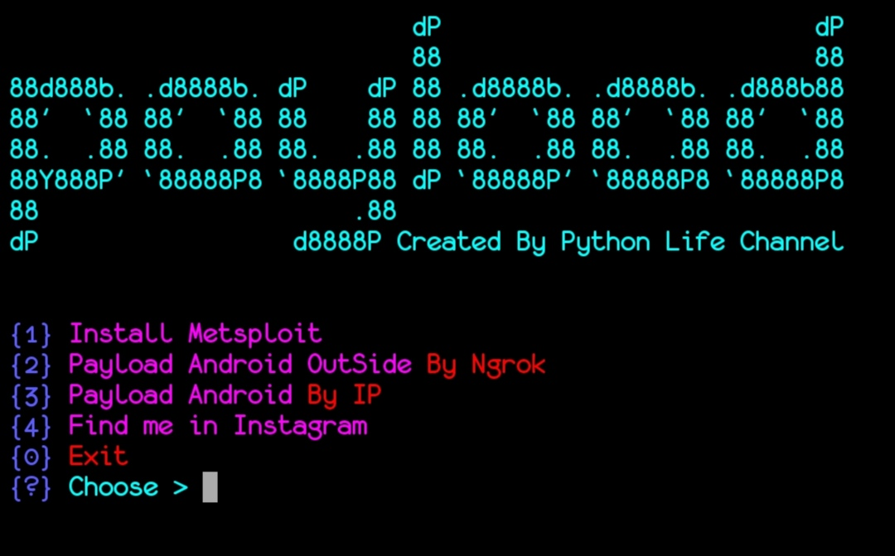
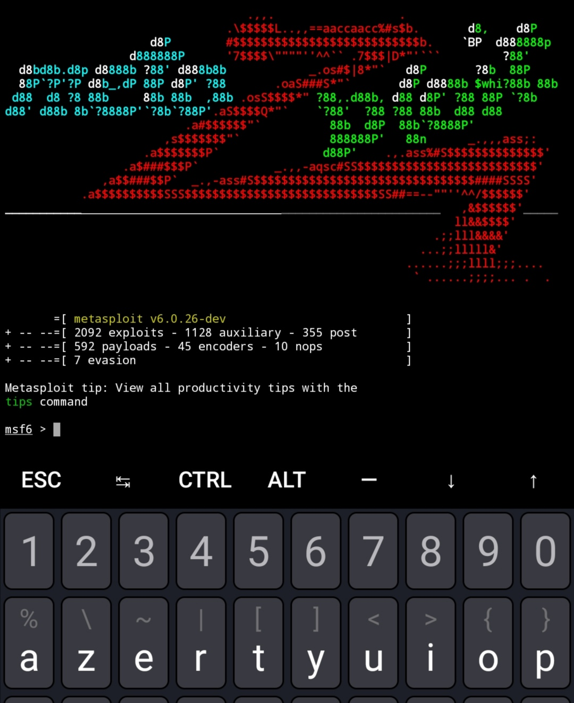

# payload   

install metasploit | create payload automatically by using metasploit

تحميل الميتاسبلويت اتوماتكيا 
و صنع بايلود اتوماتكيا للختراق الخارجي مع النجروك 
 رابط الشرح في الاسفل حتى تفهم كيفية الاستعمال 
https://youtu.be/6wht7llW31w

``
$ pkg update && upgrade -y
``

``
$ pkg install bash -y;pkg install python -y;pkg install git -y
``

``
$ git clone https://github.com/python-life/payload
``

``
$ cd payload
``

``
$ chmod +x *
``

``
$ bash setup.sh
``

``
$ python payload
``

# Enjoy 

## Find Me on :

